Exercise 00 - Move to the LEFT, move to the RIGHT

```sql
SELECT p.name AS pizzeria_name, p.rating
FROM pizzeria p
LEFT JOIN person_visits pv ON p.id = pv.pizzeria_id
WHERE pv.id IS NULL;
```
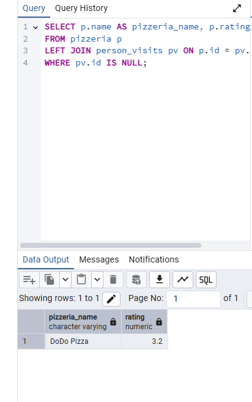


Exercise 01 – Find data gaps

```sql
SELECT all_dates.missing_date
FROM (
    SELECT generate_series('2022-01-01'::date, '2022-01-10'::date, INTERVAL '1 day') AS missing_date
) AS all_dates
LEFT JOIN (
    SELECT DISTINCT visit_date
    FROM person_visits
    WHERE person_id = 1 OR person_id = 2
) AS visits ON all_dates.missing_date = visits.visit_date
WHERE visits.visit_date IS NULL
ORDER BY all_dates.missing_date;
```
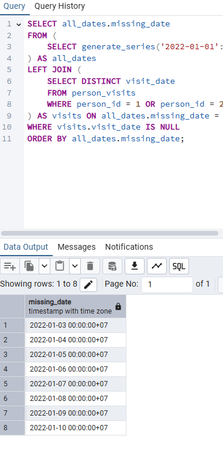


Exercise 02 - FULL means ‘completely filled’

```sql
SELECT 
    COALESCE(p.name, '-') AS person_name,
    pv.visit_date,
    COALESCE(pi.name, '-') AS pizzeria_name
FROM 
    person p
FULL OUTER JOIN 
    (
        SELECT 
            pv.person_id, 
            pv.pizzeria_id, 
            pv.visit_date
        FROM 
            person_visits pv
        WHERE 
            pv.visit_date BETWEEN '2022-01-01' AND '2022-01-03'
    ) pv ON p.id = pv.person_id
FULL OUTER JOIN 
    pizzeria pi ON pi.id = pv.pizzeria_id
ORDER BY 
    person_name, 
    visit_date, 
    pizzeria_name;
```
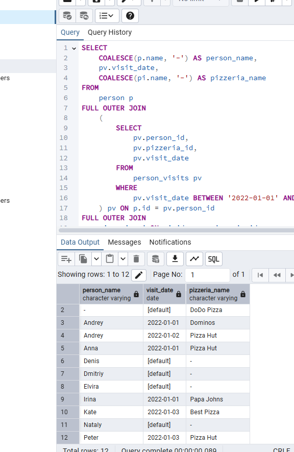


Exercise 03 - Reformat to CTE

```sql
WITH all_dates AS (
    SELECT generate_series('2022-01-01'::date, '2022-01-10'::date, '1 day')::date AS visit_date
)

SELECT ad.visit_date AS missing_date
FROM all_dates ad
LEFT JOIN person_visits pv ON ad.visit_date = pv.visit_date
WHERE pv.id IS NULL
ORDER BY missing_date;
```
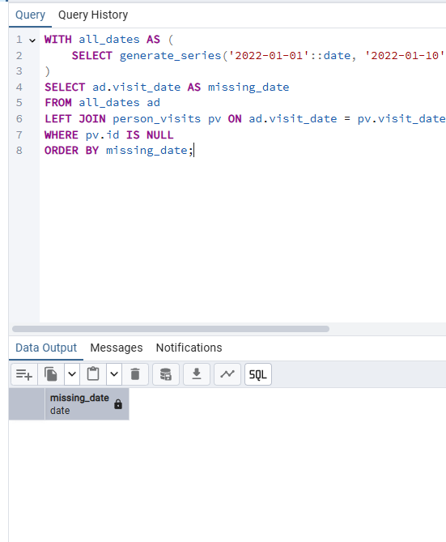

Exercise 04 - Find favourite pizzas

```sql
SELECT 
    m.pizza_name,
    p.name AS pizzeria_name,
    m.price
FROM 
    menu m
JOIN 
    pizzeria p ON m.pizzeria_id = p.id
WHERE 
    m.pizza_name IN ('mushroom pizza', 'pepperoni pizza')
ORDER BY 
    m.pizza_name, 
    p.name;
```
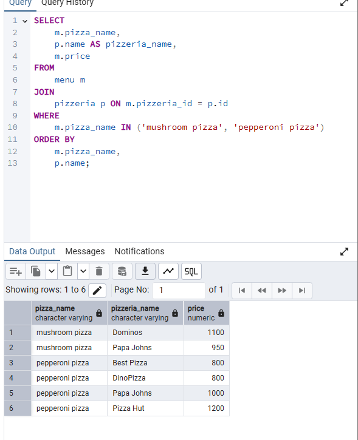


Exercise 05 - Investigate Person Data

```sql
SELECT 
    name
FROM 
    person
WHERE 
    gender = 'female' 
    AND age > 25
ORDER BY 
    name;
```
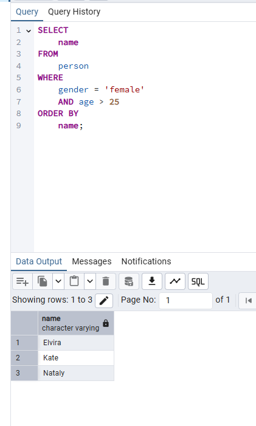


Exercise 06 - favourite pizzas for Denis and Anna

```sql
SELECT 
    m.pizza_name,
    p.name AS pizzeria_name
FROM 
    person_order po
JOIN 
    menu m ON po.menu_id = m.id
JOIN 
    pizzeria p ON m.pizzeria_id = p.id
JOIN 
    person per ON po.person_id = per.id
WHERE 
    per.name IN ('Denis', 'Anna')
ORDER BY 
    m.pizza_name, 
    p.name;
```
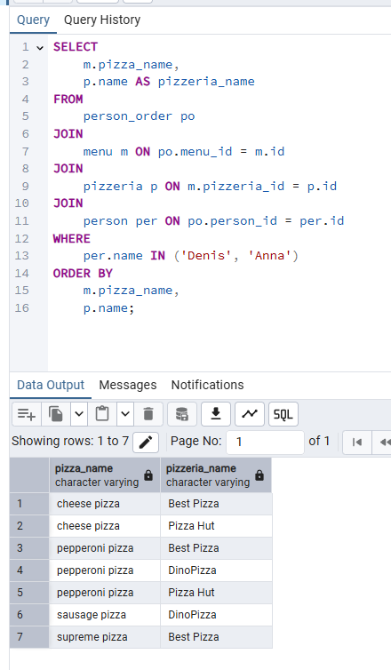


Exercise 07 - Cheapest pizzeria for Dmitriy

```sql
SELECT DISTINCT 
    p.name AS pizzeria_name
FROM 
    person per
JOIN 
    person_visits pv ON per.id = pv.person_id
JOIN 
    pizzeria p ON pv.pizzeria_id = p.id
JOIN 
    menu m ON p.id = m.pizzeria_id
WHERE 
    per.name = 'Dmitriy'
    AND pv.visit_date = '2022-01-08'
    AND m.price < 800;
```
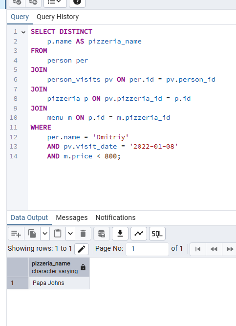


Exercise 08 - Continuing to research data

```sql
SELECT DISTINCT 
    per.name
FROM 
    person per
JOIN 
    person_order po ON per.id = po.person_id
JOIN 
    menu m ON po.menu_id = m.id
WHERE 
    per.gender = 'male'
    AND per.address IN ('Moscow', 'Samara')
    AND m.pizza_name IN ('pepperoni pizza', 'mushroom pizza')
ORDER BY 
    per.name DESC;
```
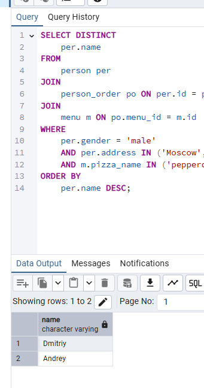


Exercise 09 - Who loves cheese and pepperoni?

```sql
SELECT DISTINCT 
    per.name
FROM 
    person per
JOIN 
    person_order po ON per.id = po.person_id
JOIN 
    menu m ON po.menu_id = m.id
WHERE 
    per.gender = 'female'
    AND m.pizza_name IN ('pepperoni pizza', 'cheese pizza')
GROUP BY 
    per.id, per.name
HAVING 
    COUNT(DISTINCT CASE WHEN m.pizza_name = 'pepperoni pizza' THEN m.id END) > 0
    AND COUNT(DISTINCT CASE WHEN m.pizza_name = 'cheese pizza' THEN m.id END) > 0
ORDER BY 
    per.name;
```
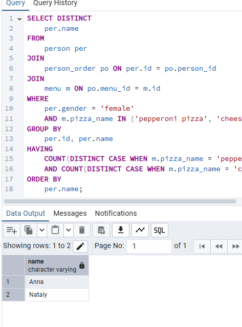


Exercise 10 - Find persons from one city

```sql
SELECT 
    p1.name AS person_name1,
    p2.name AS person_name2,
    p1.address AS common_address
FROM 
    person p1
JOIN 
    person p2 ON p1.address = p2.address AND p1.id < p2.id
ORDER BY 
    p1.name, 
    p2.name, 
    p1.address;
```
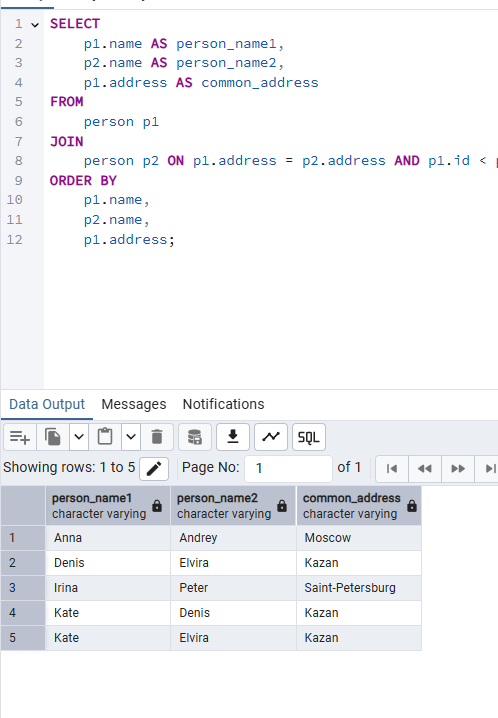